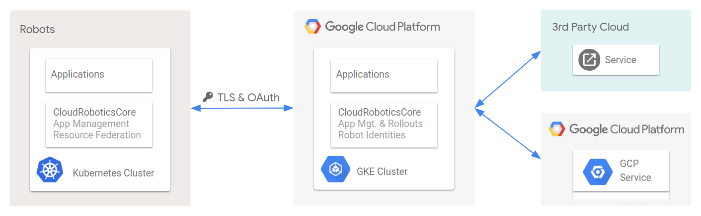

# Cloud Robotics Core

HAPPY DUMMY CHANGE

Google's Cloud Robotics Core is an open source platform that provides
infrastructure essential to building and running robotics solutions for business
automation. Cloud Robotics Core makes managing robot fleets easy for developers,
integrators, and operators. It enables:

* packaging and distribution of applications
* secure, bidirectional robot-cloud communication
* easy access to Google Cloud services such as ML, logging, and monitoring.

Cloud Robotics Core is open source and pre-alpha. Support is currently limited
to a small set of early access partners. We will gladly accept contributions
and feedback, but we are making no stability or support guarantees at this
point in time.

# Documentation

Documentation of the platform and related How-to guides can be found at: https://googlecloudrobotics.github.io/core/

# Get Involved

If you want to get involved, please refer to [CONTRIBUTING.md](CONTRIBUTING.md),
reach out to [cloud-robotics-discuss@googlegroups.com](https://groups.google.com/forum/#!forum/cloud-robotics-discuss)
or ask Stack Overflow questions with [#google-cloud-robotics](https://stackoverflow.com/questions/tagged/google-cloud-robotics).

# Source Code

Most interesting bits are under `src`:
* app_charts: contains kubernetes resources for the core platform and apps
* bootstrap: provisioning for the cloud (terraform) and the robot (debian package)
* go/: the code that goes into images referenced from `app_charts`

The root directory contains a `deploy.sh` script for building and installing the software. More
details on that are in the [building from sources](how-to/deploy-from-sources) guide.
