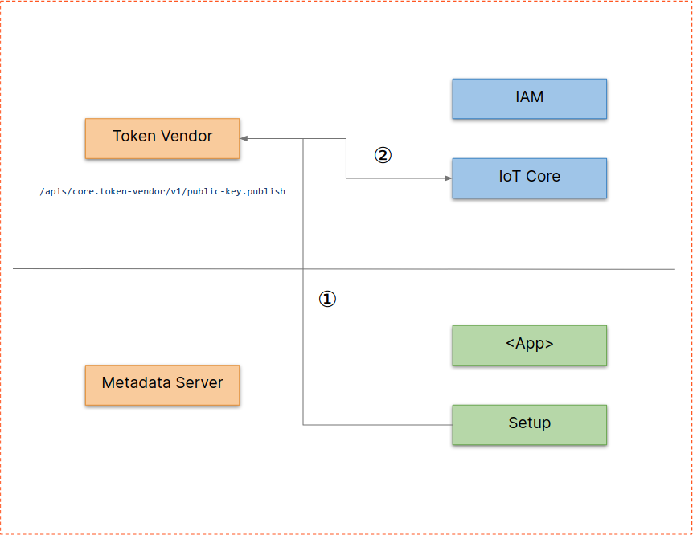
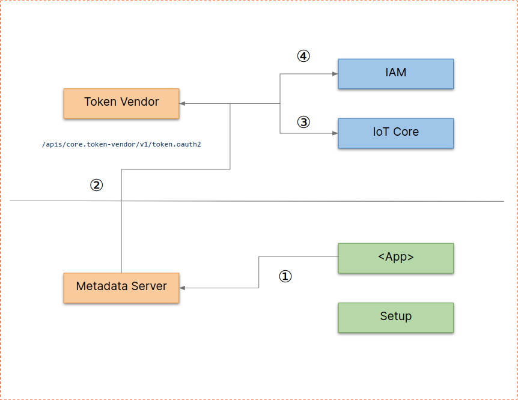

# Device Identity

Device Identity, part of Layer 1, provides an identity for robot clusters and
services to integrate those identities into a cloud based IAM system.

The following components are part of the whole setup:
* Cloud:
  * `IAM`: Cloud Identity and Access Management
  * `Kubernetes configmaps`: used as a Key Management Service
  * `Token Vendor`: token exchange service for OAuth2 service accounts
  * `robot service-account`: a GCP IAM service account that has the union of
    permissions that applications running on the robot cluster require
* Robot cluster (on-prem or edge):
  * `Metadata Server`: provides default credentials + project metadata
  * `Setup`: special app used to register the workcell
  * `<App>`: any app accessing the cloud

The following chapters explain the flows in more detail. Further information
about the Token Vendor can be found in its
[docs](https://github.com/googlecloudrobotics/core/tree/master/src/java/com/cloudrobotics/tokenvendor/README.md)

## Setup

The setup flow is used to register a new robot cluster to a cloud project.

* (1) (Admin-)user runs `Setup`, which generates a RSA key-pair and stores it as
  a K8S secret
* (2) `Setup` uploads the public key to `Token Vendor`
* (3) `Token Vendor` stores key in `Kubernetes`

## Authentication

The authentication flow is used to transparently make cloud api calls work for
on-prem robot clusters.

* `<App>` creates an API client without loading any custom key material
* (1) API client library probes `Metadata Server` to get ADCs (Application
  Default Credentials)
* (2) `Metadata Server` talks to `Token Vendor` get an Access Token for the
  `robot service-account`
* (3) `Token Vendor` verifies the key the request has been signed with against
  the device registry
* (4) `Token Vendor` gets an Access Token for the `robot service-account` from
  `IAM`
* `Token Vendor` returns Access Token through `Metadata Server` to the
  `<App>` and that can use it to call Cloud APIs under the scope of the
  `robot service-account`

