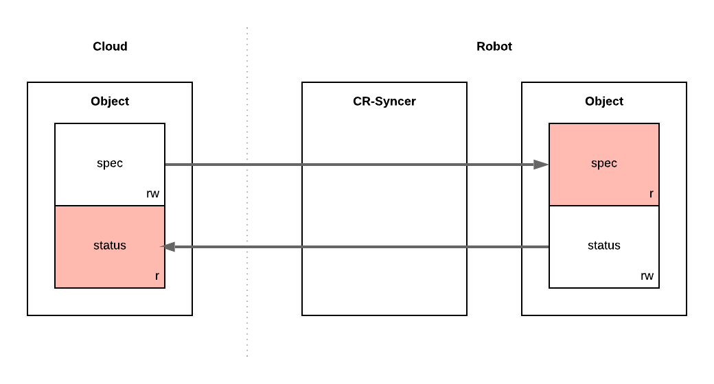

# Federation

Federation, part of Layer 1, is responsible for synchronizing the state between robot and cloud
clusters. Configuration state in Cloud Robotics Core is primarily expressed through [custom
resources](https://kubernetes.io/docs/concepts/extend-kubernetes/api-extension/custom-resources/)
by platform and user applications alike. Our federation system enables other components to use
custom resources locally without needing to be aware of the multi cluster setup and the quality
of the network connection.

## Semantics
A Kubernetes resource is typically divided into a [“spec” and a “status”](https://kubernetes.io/docs/concepts/overview/working-with-objects/kubernetes-objects/#object-spec-and-status)
section. The `spec` section expresses the intent of the resource, typically authored by a user
or another application along with all its metadata.
The `status` section must generally only be written to by the controller that is responsible for
realizing the specification. Consequently, `spec` and `status` typically each have one distinct
author.

For federating resources, this means that `spec` and `status` of a resource are owned by at most
one cluster respectively (possibly the same one). The cluster owning the spec is also the main
owner of the resource overall and controls its lifecycle, i.e. deletion.
A resource’s spec is always synced from cluster A to B and its status synced back from B to A.

All resources of a specific type may either be synchronized to all robots or to exactly one robot.
There is no direct synchronization between robots. However, a robot may create a resource in the
cloud cluster that will be distributed to other robots.

If a resource owned by cluster A has been synchronized to one or more clusters, it can only be
permanently deleted in cluster A. It’s full deletion in A will be blocked until it has been
propagated and completed across all clusters that held a copy of the resource.

## cr-syncer
The cr-syncer component (Custom Resource Syncer) is a controller that runs once inside each robot
cluster. It is connected to the Kubernetes API servers of the cloud and the robot cluster alike
and continuously watches for updates on custom resources. The controller contains retry and resync
logic to address intermittent connectivity.

The behavior of the cr-syncer can be configured per custom resource definition (CRD) by setting
annotations on its CRD:

* `cr-syncer.cloudrobotics.com/spec-source`: may be `cloud` or `robot`. It determines which
  cluster type owns metadata, spec, and lifecycle of all resources of the CRD. It implies
  that the other cluster type owns the status section.
* `cr-syncer.cloudrobotics.com/filter-by-robot-name`: a boolean that determines whether resources
  will be synced to all robots or just a single one. An individual resource is labeled with
  `cloudrobotics.com/robot-name` to indicate which robot it should be synced to. If the label
  is missing on a resource, it will not be synced at all.
* `cr-syncer.cloudrobotics.com/status-subtree`: a string key, which defines which sub-section of
  the resource status is synced from the cluster that’s not the spec source. This allows for
  example, to split a resource’s status into a `robot` and `cloud` section. Using this annotation
  is generally discouraged as it likely points to a flaw in the modeling of the respective CRD.

## Finalizers
The cr-syncer uses finalizers to ensure that resource deletions in the spec-source cluster have
fully propagated and completed across all other clusters. When a resource owned by cluster A is
synchronized to cluster B for the first time, the cr-syncer adds a [Kubernetes finalizer](https://kubernetes.io/docs/concepts/workloads/controllers/garbage-collection/)
of the form `B.synced.cr-syncer.cloudrobotics.com` to the resource in cluster A.

When the resource is deleted in cluster A, it’s deletion will be blocked but the intent will be
propagated to cluster B by the cr-syncer. Once deletion has completed in cluster B, the
cr-syncer will remove the finalizer in cluster A and deletion can complete there as well.
