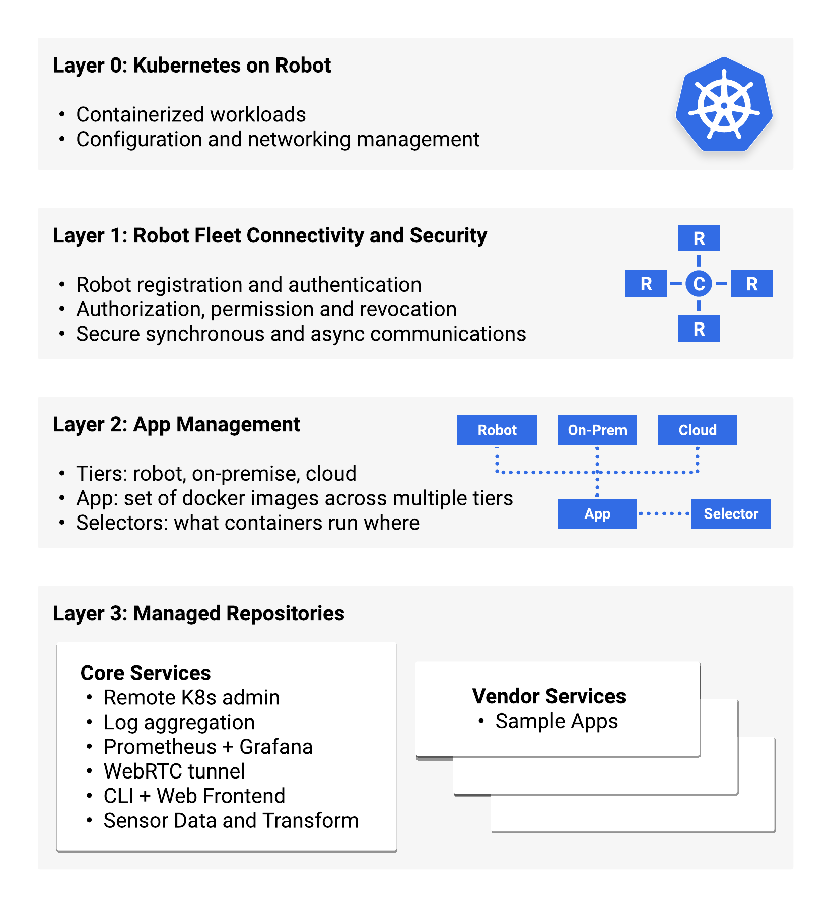

# Overview of Cloud Robotics Core

To understand Cloud Robotics Core, you should be familiar with the following concepts:

**Docker containers**
: Containers decouple applications from the environment in which they run. They let you deploy applications easily and consistently, regardless of whether the target environment is a robot, an on-premise data center, or the public cloud. Docker is a popular, open-source container format. Read more about [Containers at Google](https://cloud.google.com/containers/).

**Kubernetes**
: Kubernetes is an open-source system to deploy, scale, and manage containerized applications anywhere. It lets you deploy containerized applications onto your robots, run them on one or more compute nodes and manage associated resources like configuration settings or networking. Read more in the [Kubernetes documentation](https://kubernetes.io/docs/concepts/overview/what-is-kubernetes/).

**Helm**
: Helm is a tool for managing Kubernetes charts. Charts are packages of pre-configured Kubernetes resources. Read more in the [Helm documentation](https://github.com/helm/helm/blob/master/README.md).

**Custom Resource (CR)**
: Custom resources are extensions of the Kubernetes API that let you manage application-specific data, offering [many features](https://kubernetes.io/docs/concepts/extend-kubernetes/api-extension/custom-resources/#common-features). To use a custom resource, you first have to create a Custom Resource Definition (CRD). Read more about [extending the Kubernetes API with Custom Resource Definitions](https://kubernetes.io/docs/tasks/access-kubernetes-api/custom-resources/custom-resource-definitions/).

## Layers

Cloud Robotics Core builds upon standard Kubernetes management tools and several open-source packages. We structure Cloud Robotics Core into several layers that address distinct needs.

### Layer 0: Kubernetes on Robot

Layer 0 is an on-robot Kubernetes setup optimized for single-node clusters. It lets you deploy containerized workloads onto the robot, run them on one or more compute nodes and manage associated resources like configuration settings or networking without the overhead of a VM.

You can try it out by following the [Running a ROS node as a Kubernetes deployment](how-to/running-ros-node) How-to Guide.

### Layer 1: Robot Fleet Connectivity and Security

Layer 1 provides secure communication and access control. Every robot is identified by a unique keypair. The public key is managed in a [Cloud IoT device registry](https://cloud.google.com/iot/docs/concepts/devices). A cloud-based authorization service uses these keys to authenticate robots and generate short-lived OAuth access tokens.

This approach follows the [BeyondCorp](https://cloud.google.com/beyondcorp/) zero trust network model: all connections are authenticated and authorized individually, without a need for a traditional VPN. A specific robot's access may be revoked if needed. The same set of credentials also serves as foundation for Apps to securely communicate with the cloud over gRPC.

You can try it out by following the [Connecting a robot to the cloud](how-to/connecting-robot) How-to Guide.

> **Note:** Layer 2 and 3 (below) are currently under development. You'll find an early implementation of these layers in our repository but corresponding APIs and concepts are not stable yet.

### Layer 2: App Management

Layer 2 introduces App management, built as a lightweight facade on top of Kubernetes and the Helm package manager. In Cloud Robotics Core, Apps consist of one or more Docker containers and associated resources, that run on the robot and in the cloud. The App management layer determines which Apps, and app components, run on robots and in the cloud.

### Layer 3: Managed Repositories

Layer 3 adds the capability to download Apps from remote repositories. Most of our core platform services will be packaged as optional downloadable extensions via a Google-managed repository. In addition, vendor-managed repositories can be added and used for locating new or updated vendor-provided Apps.

Apps provide DevOps and robotics services such as:

* Logs aggregation and stack traces with StackDriver
* Metric collection, upload and dashboarding with Prometheus and Grafana
* Sensor data transport for cloud-based analysis
* Remote debugging using RViz over WebRTC
* Remote administration
