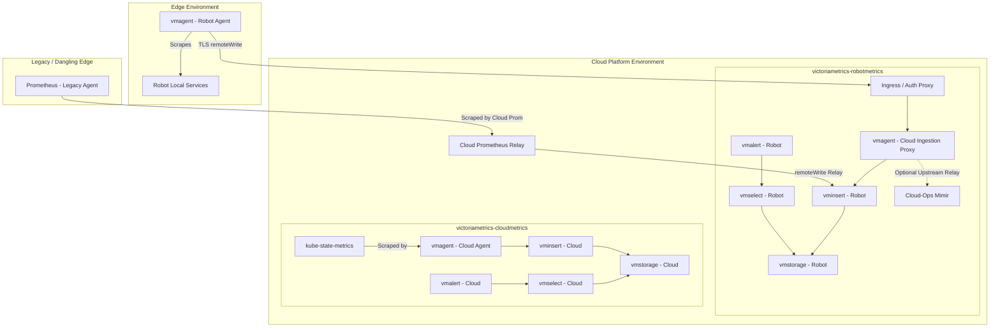

# VictoriaMetrics Telemetry Architecture

## Overview

VictoriaMetrics in this repository is split into two distinct observability domains to isolate high-cardinality, potentially unstable network edge telemetry from internal cloud infrastructure telemetry.

Both components live under this directory:

1. **`victoriametrics-robotmetrics`**: 
   * **Domain**: Robot telemetry (data originating from physical edge robots).
   * **Deployment Targets**: Deploys `vmagent` on edge robots, and a complete `vmcluster` in the cloud to receive, store, and alert on robot data.
2. **`victoriametrics-cloudmetrics`**:
   * **Domain**: Cloud telemetry (data originating from cloud microservices and Kubernetes infrastructure).
   * **Deployment Target**: Cloud-only. Scrapes `kube-state-metrics`, node exporters, and cloud services into a dedicated internal `vmcluster`.

---

## Unified Architecture Diagram

## Documentation

* [Robot Metrics README](victoriametrics-robotmetrics/README.md)
* [Cloud Metrics README](victoriametrics-cloudmetrics/README.md)
