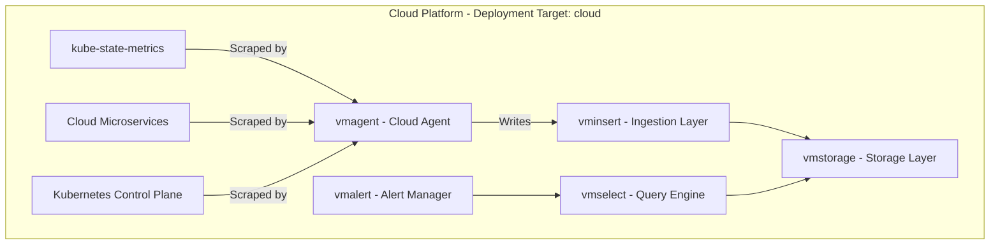
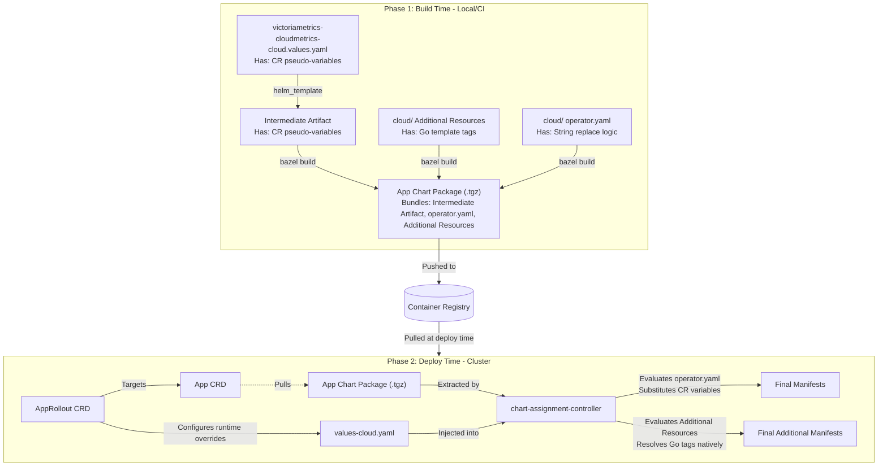

# VictoriaMetrics - Cloud Metrics (`victoriametrics-cloudmetrics`)

## Overview

`victoriametrics-cloudmetrics` is the observability app chart dedicated exclusively to **Cloud Service and Infrastructure Telemetry** (metrics originating within the cloud platform and Kubernetes control plane).

Unlike `victoriametrics-robotmetrics`, this chart is **cloud-only** and has no edge or robot component.

---

## Architecture Diagram

---

## Key Terminology

* **Telemetry Domain**: `cloudmetrics` (What is measured: metrics originating from cloud services and Kubernetes infrastructure).
* **Deployment Target**: `cloud` (Cloud-only deployment; no robot edge agent).

---

## Configuration Data Flow

The configuration of this chart passes through a two-phase template expansion. Phase 1 (Build Time) bypasses Helm's static schema validation by injecting placeholder variables. Phase 2 (Deploy Time) resolves those placeholders using AppRollout configurations, while simultaneously evaluating natively authored supplementary templates.

*See the [App Chart Variable Substitution Guide](../../app_charts_variable_substitution.md) for more details on the exact substitution steps and intermediate artifact extraction.*

### File Reference

#### Build-Time Files (Phase 1)
* `BUILD.bazel`: Renders the upstream helm chart and packages everything into an `app_chart` tarball.
* `victoriametrics-cloudmetrics-cloud.values.yaml`: Build-time helm values. It configures the core components but contains pseudo-variables (e.g., `$CR_VICTORIAMETRICS_CLOUDMETRICS_VMSTORAGE_RESOURCES_OBJECT: REMOVE_ME`) to bypass strict Helm array/object schema validation.
* **Intermediate Artifact**: An internal YAML file generated by `helm_template` and bundled into the `app_chart`. It still contains the `$CR_...` pseudo-variables.

#### Deploy-Time Files (Phase 2)
* **App CRD**: The resource pointing to the `app_chart` tarball in the registry.
* **AppRollout CRD**: The orchestrating resource that provisions runtime overrides (replicas, scaling limits, retention times) via the `values-cloud.yaml` structure.
* `values-cloud.yaml`: The runtime configuration payload injected by the AppRollout.
* `cloud/victoriametrics-cloudmetrics-operator.yaml`: The deployment script (Go `text/template`). Executed by the `chart-assignment-controller`, it reads the Intermediate Artifact and substitutes the `$CR_...` pseudo-variables with the structured data from `values-cloud.yaml`. This is where pseudo-variables cease to exist.

#### Additional Resources
These natively authored YAMLs reside in the `cloud/` directory and are bundled into the App Chart package. They do NOT contain pseudo-variables. Instead, they use standard Go text/template tags (e.g., `{{ .Values.domain }}`). The `chart-assignment-controller` evaluates them natively alongside `operator.yaml` using the data injected from `values-cloud.yaml`.
* `cloud/victoriametrics-cloudmetrics-ingress.yaml`: Ingress definition exposing the `vmselect` UI/API behind OAuth2 proxy authentication.
* `cloud/victoriametrics-cloudmetrics-read-http-route.yaml`: Gateway API `HTTPRoute` for modern secured access to `vmselect`.
* `cloud/base-alerts.yaml`: Prometheus alerting rules specific to cloud infrastructure.
### Accessing the Cloudmetrics UI

You can securely access the internal cluster metrics and dashboards through the authenticated Ingress endpoints:

* **VMUI (Query Dashboard):** `https://<domain>/cloudmetrics`  
  *(Automatically redirects to the main `vmselect` Prometheus-compatible querying interface)*
* **Active Alerts Dashboard:** `https://<domain>/cloudmetrics/vmalert/`
* **Scrape Targets & Service Discovery:** `https://<domain>/cloudmetrics/vmagent/targets`
