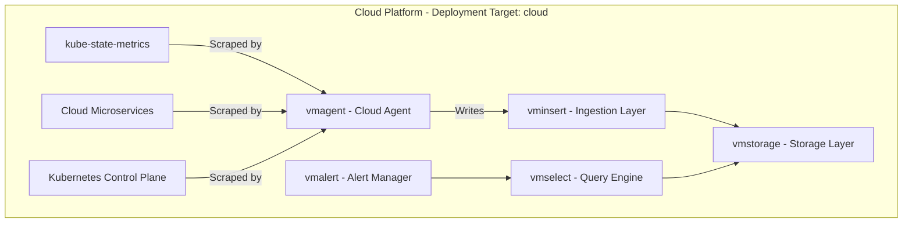

# VictoriaMetrics - Cloud Metrics (`victoriametrics-cloudmetrics`)

## Overview

`victoriametrics-cloudmetrics` is the observability app chart dedicated exclusively to **Cloud Service and Infrastructure Telemetry** (metrics originating within the cloud platform and Kubernetes control plane).

Unlike `victoriametrics-robotmetrics`, this chart is **cloud-only** and has no edge or robot component.

---

## Architecture Diagram

---

## Key Terminology

* **Telemetry Domain**: `cloudmetrics` (What is measured: metrics originating from cloud services and Kubernetes infrastructure).
* **Deployment Target**: `cloud` (Cloud-only deployment; no robot edge agent).
