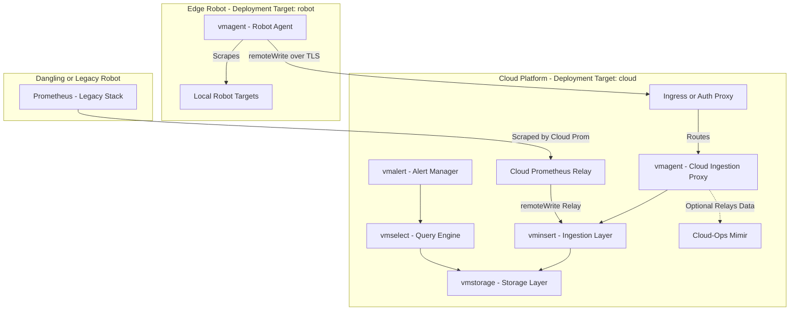

# VictoriaMetrics - Robot Metrics (`victoriametrics-robotmetrics`)

## Overview

`victoriametrics-robotmetrics` is the observability app chart dedicated to **Robot Telemetry** (metrics originating from edge robots). 

Because robot telemetry spans across the network boundary between edge devices and the cloud platform, this chart defines two distinct deployment targets:

1. **Robot Target (`values-robot.yaml`)**: Deploys lightweight edge agents (`vmagent`) directly onto edge robots to scrape local targets.
2. **Cloud Target (`values-cloud.yaml`)**: Deploys the central ingestion, storage, and alerting cluster (`vmcluster`, `vmalert`) in the cloud.

Additionally, for backward compatibility during migration, the cloud Prometheus instance relays metrics from legacy or un-upgraded robots directly into the cloud `vminsert` endpoint via `remoteWrite`.

---

## Architecture Diagram

---

## Key Terminology

* **Telemetry Domain**: `robotmetrics` (What is measured: telemetry originating from edge robots).
* **Deployment Targets**:
  * `robot`: Deploys `vmagent` on the physical robot.
  * `cloud`: Deploys `vmcluster` (`vminsert`, `vmstorage`, `vmselect`, `vmalert`) in the cloud.
