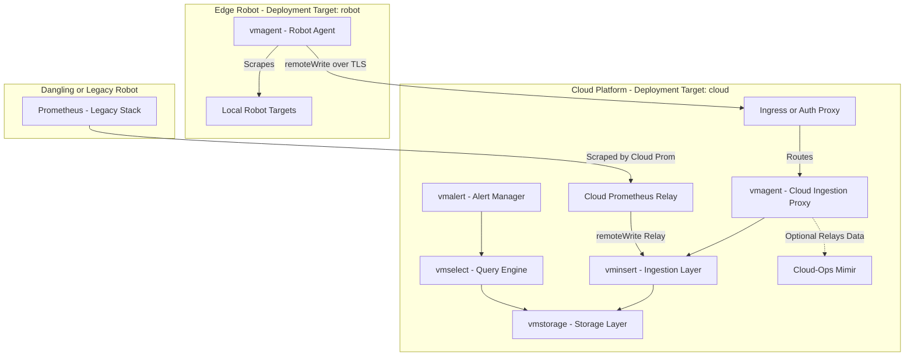
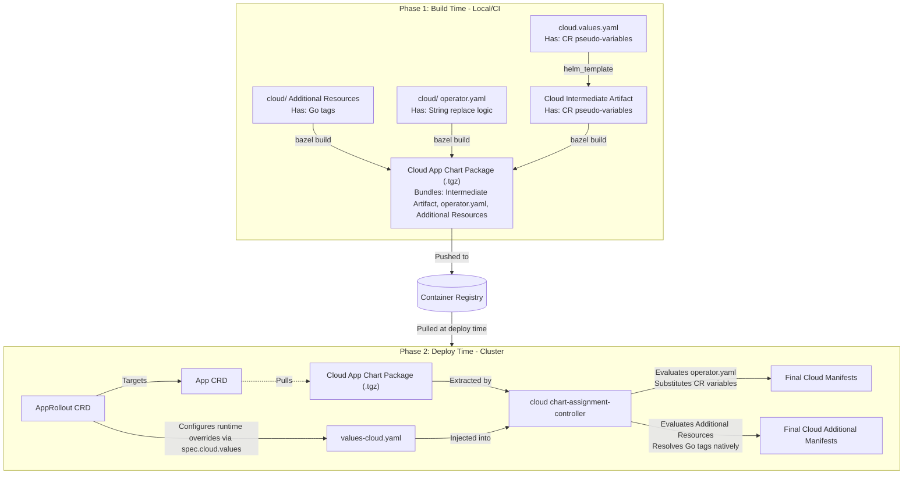

# VictoriaMetrics - Robot Metrics (`victoriametrics-robotmetrics`)

## Overview

`victoriametrics-robotmetrics` is the observability app chart dedicated to **Robot Telemetry** (metrics originating from edge robots). 

Because robot telemetry spans across the network boundary between edge devices and the cloud platform, this chart defines two distinct deployment targets:

1. **Robot Target (`values-robot.yaml`)**: Deploys lightweight edge agents (`vmagent`) directly onto edge robots to scrape local targets.
2. **Cloud Target (`values-cloud.yaml`)**: Deploys the central ingestion, storage, and alerting cluster (`vmcluster`, `vmalert`) in the cloud.

Additionally, for backward compatibility during migration, the cloud Prometheus instance relays metrics from legacy or un-upgraded robots directly into the cloud `vminsert` endpoint via `remoteWrite`.

---

## Architecture Diagram

---

## Key Terminology

* **Telemetry Domain**: `robotmetrics` (What is measured: telemetry originating from edge robots).
* **Deployment Targets**:
  * `robot`: Deploys `vmagent` on the physical robot.
  * `cloud`: Deploys `vmcluster` (`vminsert`, `vmstorage`, `vmselect`, `vmalert`) in the cloud.

---

## Configuration Data Flow

This chart packages two independent Helm configurations (one for the cloud ingestion hub, one for the edge scraping agent) into a single `app` target. Phase 1 (Build Time) bypasses Helm's static schema validation by injecting placeholder variables into intermediate artifacts. Phase 2 (Deploy Time) resolves those placeholders using targeted AppRollout configurations, while simultaneously evaluating natively authored supplementary templates.

*See the [App Chart Variable Substitution Guide](../../app_charts_variable_substitution.md) for more details on the exact substitution steps and intermediate artifact extraction.*

### Target Deployment Flow

The diagram below illustrates the deployment pipeline for the **cloud target**. The **robot target** follows an identical, parallel process using its respective `robot.values.yaml` build parameters and `values-robot.yaml` runtime overrides.

### File Reference

#### Build-Time Files (Phase 1)
* `BUILD.bazel`: Renders the chart and packages both the cloud and robot targets into `app_chart` tarballs.
* `victoriametrics-robotmetrics-cloud.values.yaml`: Configures the cloud ingestion stack. It enables storage components and configures a proxy `vmagent` using pseudo-variables (e.g., `$CR_...: REMOVE_ME`) for array fields to pass strict Helm typing checks.
* `victoriametrics-robotmetrics-robot.values.yaml`: Configures the edge agent stack. It disables cluster storage components and uses pseudo-variables to configure `vmagent` scraping.
* **Intermediate Artifacts**: Internal YAML files generated by `helm_template` and bundled into the respective `app_chart` packages. They contain the unresolved `$CR_...` pseudo-variables.

#### Deploy-Time Files (Phase 2)
* **App CRD**: The resource pointing to the `app_chart` tarballs in the registry.
* **AppRollout CRD**: The orchestrating resource that targets distinct node selectors and injects scoped configuration into the `values-cloud.yaml` or `values-robot.yaml` structures.
* `values-cloud.yaml`: Deployment parameters mapped from the AppRollout for the cloud ingestion components.
* `values-robot.yaml`: Deployment parameters mapped from the AppRollout for specific edge robots.
* `cloud/victoriametrics-robotmetrics-operator.yaml`: Go template executed in the cloud. It loads the Cloud Intermediate Artifact and replaces the `$CR_...` pseudo-variables with structured data from `values-cloud.yaml`. This removes the pseudo-variables completely.
* `robot/victoriametrics-robotmetrics-operator.yaml`: Go template executed on edge robots. It loads the Robot Intermediate Artifact and replaces the `$CR_...` pseudo-variables with structured data from `values-robot.yaml`. This removes the pseudo-variables completely.

#### Additional Cloud Resources (Ingestion Hub)
These natively-authored YAMLs reside in the `cloud/` directory and are bundled into the Cloud App Chart package. They do NOT contain pseudo-variables. Instead, they use standard Go text/template tags (e.g., `{{ .Values.domain }}`). The `chart-assignment-controller` evaluates them natively alongside the rendered operator outputs.
* `cloud/victoriametrics-robotmetrics-ingress.yaml`, `cloud/victoriametrics-robotmetrics-read-http-route.yaml`: Exposes the `vmselect` query UI behind interactive OAuth2 authentication.
* `cloud/victoriametrics-robotmetrics-write-ingress.yaml`, `cloud/victoriametrics-robotmetrics-write-http-route.yaml`: Machine-to-machine endpoints exposing the proxy `vmagent`/`vminsert` to edge robots for `remoteWrite` data ingestion (secured via `apikey` tokens).

#### Additional Robot Resources (Edge)
These natively-authored YAMLs reside in the `robot/` directory and are bundled into the Robot App Chart package. They use standard Go text/template tags and are evaluated natively by the controller.
* `robot/smartctl-exporter.yaml`: Hardware exporter DaemonSet deployed to robots to read S.M.A.R.T. disk stats.
### Accessing the Robotmetrics UI

You can securely access the edge robot telemetry metrics and dashboards through the authenticated Ingress endpoints:

* **VMUI (Query Dashboard):** `https://<domain>/victoriametrics/robots`  
  *(Automatically redirects to the main `vmselect` Prometheus-compatible querying interface)*
* **Active Alerts Dashboard:** `https://<domain>/victoriametrics/robots/vmalert/`
* **Scraper Targets & Service Discovery:** `https://<domain>/victoriametrics/robots/vmagent/targets`
