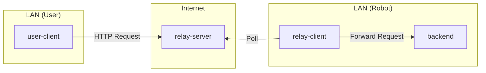
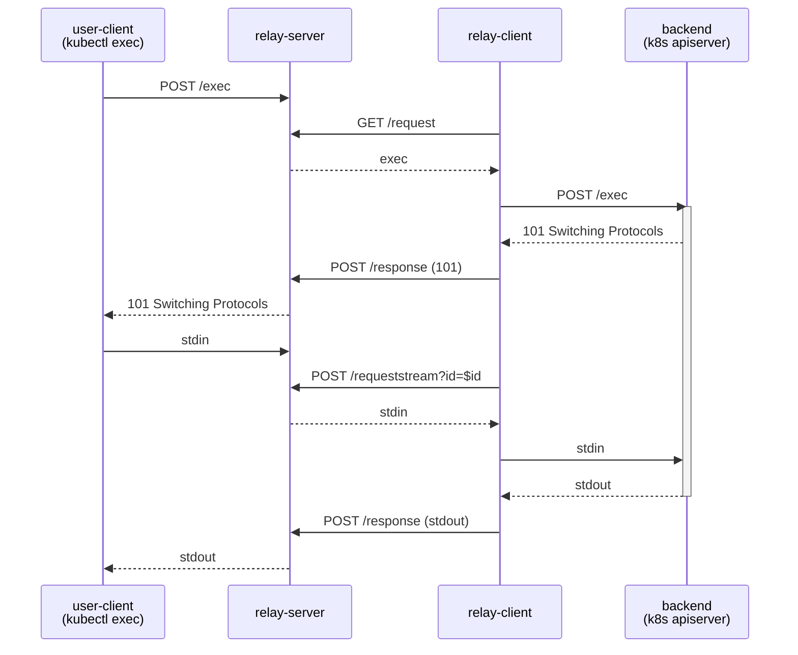

# HTTP Relay Server

The http-relay-server multiplexes HTTP requests between user-clients and backends (robots) via a relay-client. It exists to make HTTP endpoints on robots accessible without requiring a public endpoint on the robot itself.

## How it works

It binds to a public endpoint accessible by both user-client and backend, and works together with a relay-client that's colocated with the backend. This allows multiple backends to be accessible through a single relay-server instance, and supports multiple concurrent user-clients.

The relay-server is multiplexing: It allows multiple relay-clients to
connect under unique names, each handling requests for a subpath of `/client`.
Alternatively (e.g. for gRPC connections) the backend can be selected by
omitting the client prefix and passing an `X-Server-Name` header.

### Sequence of operations

1. User-client makes request on `/client/$foo/$request`.
2. Relay-server assigns an ID and stores request (with path `$request`) in
   memory. It keeps the user-client's request pending.
3. Relay-client requests `/server/request?server=$foo`
4. Relay-server responds with stored request (or timeout if no request comes
   in within the next 30 sec).
5. Relay-client makes the stored request to backend.
6. Backend replies.
7. Relay-client posts backend's reply to `/server/response`.
8. Relay-server responds to client's request with backend's reply.

For some requests (e.g. `kubectl exec`), the backend responds with
`101 Switching Protocols`, resulting in the following operations:

1. Relay-server responds to client's request with backend's 101 reply.
2. User-client sends bytes from stdin to the relay-server.
3. Relay-client requests `/server/requeststream?id=$id`.
4. Relay-server responds with stdin bytes from client.
5. Relay-client sends stdin bytes to backend.
6. Backend sends stdout bytes to relay-client.
7. Relay-client posts stdout bytes to `/server/response`.
8. Relay-server sends stdout bytes to the client.

This simplified graphic shows the back-and-forth for an `exec` request:

The relay-client side implementation is in `../http-relay-client`.

## Tested capabilities

The http-relay-server was originally designed as a way to use kubectl against remote clusters.
It traverses firewalls by only making outbound requests to the public internet from both the user client (eg kubectl, browser) and the remote cluster.
It has been tested with the following traffic:

- HTTP 1.1 & 2 from web browsers (including bidirectional streaming with websockets)
- HTTP 1.1 from kubectl, including streaming response bodies for `kubectl logs`
- SPDY from kubectl (via HTTP 101 Switching Protocols) for `kubectl exec`
- Unidirectional gRPC (HTTP2 cleartext and HTTP trailers)
- Streaming gRPC (server, client, and bi-directional)

The following has not been tested:

- HTTP 1.1 streaming request body (`Transfer-Encoding: chunked` in the request header)

## Flags

- `--port`: Port number to listen on (default: 80).
- `--block_size`: Size of i/o buffer in bytes (default: 10240).
- `--inactive_request_timeout`: Timeout for inactive requests (default: 60s). In particular, this sets a limit on how long the backend can wait before writing headers and the response status.

## Configuration

### Nginx Timeout

If you are running the relay server behind Nginx, ensure that the proxy read timeout on Nginx is set such that Nginx doesn't time out before the http-relay-server does.

Specifically, the `nginx.ingress.kubernetes.io/proxy-read-timeout` annotation (or `proxy_read_timeout` directive in nginx config) should be set to a value larger than `--inactive_request_timeout`.

For example, if `--inactive_request_timeout` is set to `60s`, you might set `nginx.ingress.kubernetes.io/proxy-read-timeout` to `75s`.

## Scalability considerations

### Single instance capacity and resource usage

A single `http-relay-server` instance is lightweight and can handle a large number of concurrent connections because it relies on Go's non-blocking I/O and goroutines.

- **Idle / long-polling backends:** Each connected `http-relay-client` maintains a long-polling request (`/server/request`). An idle backend holds only a minimal in-memory state entry ([backendState](server/broker.go#L130-L133)) and one goroutine (~2–8 KB of stack memory). Thus, 1,000 idle backends require ~5–10 MB of RAM, and 10,000 idle backends require less than 100 MB of RAM.
- **Active requests and streaming:** In-flight requests allocate a [pendingResponse](server/broker.go#L93-L115) tracking object and unbuffered channels. Memory consumption for streaming traffic is bounded by the chunk size (the relay client defaults to 1 MB max chunks and 64 KB I/O blocks) and the network buffers for active transfers. For typical workloads with tens to hundreds of concurrent active requests, memory usage remains modest (tens of megabytes).
- **Resource recommendation:** The default deployment requests `16Mi` memory and `100m` CPU. For production environments handling hundreds of active streams or thousands of connected robots, allocating 512 MB to 1 GB of memory and 1–2 CPU cores provides ample headroom.

### System, socket, and infrastructure limits

When scaling to thousands of concurrent connections or high throughput, consider the following non-memory limits:

- **File descriptors & sockets:** Each open TCP connection (from user clients, long-polling robot clients, or ingress proxies) consumes an OS file descriptor. Ensure the container and host `ulimit -n` is configured with sufficient headroom (e.g., 65,535) to prevent `too many open files` errors.
- **Kernel TCP socket memory:** Outside the Go heap, the Linux kernel allocates read/write buffers (`rmem`/`wmem`) for each open TCP socket. For 10,000+ persistent connections, kernel socket memory can consume several hundred megabytes of system RAM.
- **Connection churn from long-polling:** Relay clients time out and re-poll every 30 seconds. A large fleet (e.g., 10,000 robots) generates a baseline of ~333 requests/sec just for idle polling. Ensure reverse proxies and Ingress controllers allow HTTP keep-alive connections to avoid exhausting ephemeral ports or conntrack table entries (`nf_conntrack_max`) with rapid TCP/TLS handshakes.
- **HTTP/2 stream concurrency:** Go's HTTP/2 server (`h2c`) defaults to a maximum of 250 concurrent streams per HTTP/2 TCP connection (`MaxConcurrentStreams`). If a single client or proxy multiplexes more than 250 simultaneous requests over one HTTP/2 connection, additional streams will be queued.
- **In-memory statefulness:** The server stores request-matching state in local memory ([broker](server/broker.go#L135-L139)). A user request and the corresponding robot's long-polling connection must reach the exact same `http-relay-server` process.
- **CPU & GC overhead:** Heavy streaming data or high request rates cause CPU load from Protobuf serialization, HTTP/2 framing, and Go garbage collection from frequent byte slice allocations.

### Scaling strategies

Because `http-relay-server` maintains routing state in memory, you cannot simply scale a single deployment horizontally behind a naive round-robin load balancer. To scale beyond a single instance, use **sharding**:

1. **Functional Sharding (by API / Traffic Type):**
   - Run separate relay server instances for different traffic profiles (e.g., one instance for low-latency Kubernetes API / control-plane RPCs, and another instance for high-throughput streaming such as `kubectl exec`, logs, or media streams).
   - Configure Kubernetes Ingress or Gateway API ([HTTPRoute](../../../app_charts/k8s-relay/cloud/http-route.yaml#L4-L86)) to route different URL paths or prefixes to the respective relay server service.
   - This isolates critical control plane traffic from being starved or delayed by high-bandwidth streaming transfers.

2. **Fleet / Tenant Sharding (by Backend / Robot):**
   - Partition robots across multiple relay server instances (e.g., shard by robot name, cluster, or tenant).
   - Configure each robot's `http-relay-client` with `--relay_prefix` or `--relay_address` pointing to its designated relay server shard.
   - Route user traffic to the appropriate shard using distinct hostnames (e.g., `relay-shard1.example.com`) or path prefixes.
