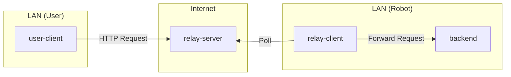
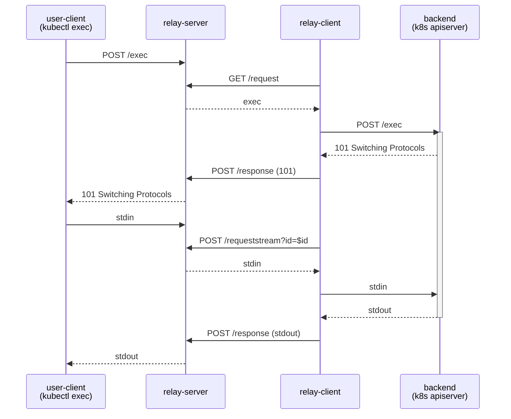

# HTTP Relay Server

The http-relay-server multiplexes HTTP requests between user-clients and backends (robots) via a relay-client. It exists to make HTTP endpoints on robots accessible without requiring a public endpoint on the robot itself.

## How it works

It binds to a public endpoint accessible by both user-client and backend, and works together with a relay-client that's colocated with the backend. This allows multiple backends to be accessible through a single relay-server instance, and supports multiple concurrent user-clients.

The relay-server is multiplexing: It allows multiple relay-clients to
connect under unique names, each handling requests for a subpath of `/client`.
Alternatively (e.g. for gRPC connections) the backend can be selected by
omitting the client prefix and passing an `X-Server-Name` header.

### Sequence of operations

1. User-client makes request on `/client/$foo/$request`.
2. Relay-server assigns an ID and stores request (with path `$request`) in
   memory. It keeps the user-client's request pending.
3. Relay-client requests `/server/request?server=$foo`
4. Relay-server responds with stored request (or timeout if no request comes
   in within the next 30 sec).
5. Relay-client makes the stored request to backend.
6. Backend replies.
7. Relay-client posts backend's reply to `/server/response`.
8. Relay-server responds to client's request with backend's reply.

For some requests (e.g. `kubectl exec`), the backend responds with
`101 Switching Protocols`, resulting in the following operations:

1. Relay-server responds to client's request with backend's 101 reply.
2. User-client sends bytes from stdin to the relay-server.
3. Relay-client requests `/server/requeststream?id=$id`.
4. Relay-server responds with stdin bytes from client.
5. Relay-client sends stdin bytes to backend.
6. Backend sends stdout bytes to relay-client.
7. Relay-client posts stdout bytes to `/server/response`.
8. Relay-server sends stdout bytes to the client.

This simplified graphic shows the back-and-forth for an `exec` request:

The relay-client side implementation is in `../http-relay-client`.

## Tested capabilities

The http-relay-server was originally designed as a way to use kubectl against remote clusters.
It traverses firewalls by only making outbound requests to the public internet from both the user client (eg kubectl, browser) and the remote cluster.
It has been tested with the following traffic:

- HTTP 1.1 & 2 from web browsers (including bidirectional streaming with websockets)
- HTTP 1.1 from kubectl, including streaming response bodies for `kubectl logs`
- SPDY from kubectl (via HTTP 101 Switching Protocols) for `kubectl exec`
- Unidirectional gRPC (HTTP2 cleartext and HTTP trailers)
- Streaming gRPC (server, client, and bi-directional)

The following has not been tested:

- HTTP 1.1 streaming request body (`Transfer-Encoding: chunked` in the request header)

## Flags

*   `--port`: Port number to listen on (default: 80).
*   `--block_size`: Size of i/o buffer in bytes (default: 10240).
*   `--inactive_request_timeout`: Timeout for inactive requests (default: 60s). In particular, this sets a limit on how long the backend can wait before writing headers and the response status.

## Configuration

### Nginx Timeout

If you are running the relay server behind Nginx, ensure that the proxy read timeout on Nginx is set such that Nginx doesn't time out before the http-relay-server does.

Specifically, the `nginx.ingress.kubernetes.io/proxy-read-timeout` annotation (or `proxy_read_timeout` directive in nginx config) should be set to a value larger than `--inactive_request_timeout`.

For example, if `--inactive_request_timeout` is set to `60s`, you might set `nginx.ingress.kubernetes.io/proxy-read-timeout` to `75s`.
